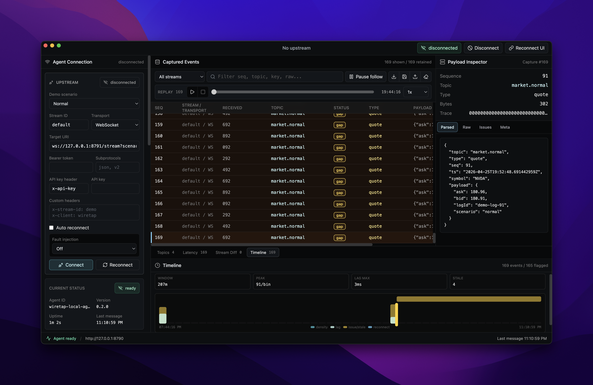

# Wiretap

Wiretap is a local debugger for real-time application streams. It captures
WebSocket and Server-Sent Events traffic through a Go agent, then presents the
stream in a SolidJS inspector so sequence gaps, duplicates, malformed payloads,
stale topics, reconnect behavior, and raw messages are visible while the system
is running.



Wiretap is built for applications where event order and freshness matter:
trading terminals, collaborative tools, dashboards, replay systems, and
event-driven internal products. It focuses on application-level stream behavior,
not packet capture or cloud observability.

## Features

- Capture WebSocket and SSE streams through a local Go agent.
- Inspect raw payloads, parsed envelopes, capture order, receive timestamps,
  transport metadata, and per-event issues.
- Detect parse errors, schema errors, oversized messages, stale scopes,
  sequence gaps, duplicates, and out-of-order events.
- Track topic and topic/key health with rates, freshness, bytes, sequence
  state, and issue counts.
- Connect with custom headers, bearer tokens, API keys, subprotocols, and
  optional auto-reconnect.
- Import and export captures as JSONL, export Tape-compatible files, and replay
  stored sessions.
- Use built-in demo streams for normal, gap, duplicate, out-of-order, stale,
  malformed, oversized, burst, and fuzz scenarios.
- Run as a web UI during development or through the Electrobun desktop shell.

## Architecture

```text
Target stream
  -> Wiretap Agent (Go)
  -> Wiretap Web UI (SolidJS)
  -> optional Wiretap Desktop shell (Electrobun)
```

The agent is the capture source of truth. It owns upstream connections,
normalization, issue detection, storage, import/export, and the local API. The
UI connects to the agent and handles filtering, selection, visualization,
payload inspection, session workflows, and replay controls.

Default local endpoints:

| Service | URL |
| --- | --- |
| Agent API | `http://localhost:8790` |
| Agent live feed | `ws://localhost:8790/live` |
| Demo WebSocket stream | `ws://localhost:8791/stream` |
| Demo SSE stream | `http://localhost:8791/stream` |

## Quick Start

Prerequisites:

- Bun 1.3+
- Go 1.24+

Install dependencies:

```sh
bun install
```

Start the Wiretap agent and bundled demo stream:

```sh
bun run dev:agent
```

Start the web UI in another terminal:

```sh
bun run dev:web
```

Open the Vite URL printed by `bun run dev:web`. The UI defaults to
`http://localhost:8790` and can connect to the bundled demo stream immediately.

## Try a Demo Stream

Use one of the demo URLs as the upstream target in the UI:

```text
ws://localhost:8791/stream?scenario=normal
ws://localhost:8791/stream?scenario=gap
ws://localhost:8791/stream?scenario=duplicate
ws://localhost:8791/stream?scenario=out_of_order
ws://localhost:8791/stream?scenario=stale
ws://localhost:8791/stream?scenario=malformed
ws://localhost:8791/stream?scenario=oversized
ws://localhost:8791/stream?scenario=burst
ws://localhost:8791/stream?scenario=fuzz
```

For SSE, use the same URLs with `http://localhost:8791/stream?...` and choose
SSE in the UI.

## Commands

```sh
bun run dev                 # run workspace dev tasks
bun run dev:agent           # run the Go capture agent and demo stream
bun run dev:web             # run the SolidJS inspector
bun run dev:desktop         # run the Electrobun desktop shell in development
bun run build               # build the workspace
bun run build:desktop       # build the stable desktop app
bun run check-types         # run TypeScript checks
bun run check               # run oxlint and oxfmt
```

Run the agent directly:

```sh
cd apps/agent
go run ./cmd/wiretap-agent
```

Agent flags:

```sh
go run ./cmd/wiretap-agent \
  -addr 127.0.0.1:8790 \
  -demo-addr 127.0.0.1:8791 \
  -data-dir /tmp/wiretap-captures
```

The capture store defaults to the OS user config directory under
`wiretap/captures`. You can override it with either `-data-dir` or
`WIRETAP_DATA_DIR`:

```sh
WIRETAP_DATA_DIR=/tmp/wiretap bun run dev:agent
```

Point the web UI at another agent:

```sh
VITE_WIRETAP_AGENT_URL=http://localhost:8790 bun run dev:web
```

You can also pass `?agentUrl=http://localhost:8790` in the browser URL.

## Stream Envelope

Wiretap keeps raw messages even when they do not parse. It gets the most useful
diagnostics from JSON messages shaped like this:

```ts
type WiretapEnvelope = {
  topic: string;
  type: string;
  seq?: number;
  ts?: number | string;
  key?: string;
  symbol?: string;
  payload?: unknown;
};
```

`topic`, `key` or `symbol`, and `seq` let Wiretap group stream scopes, track
freshness, and detect ordering problems. Extraction rules are configurable from
the UI and through the `/extraction-rules` endpoint for streams that use
different field names.

## Agent API

The local agent exposes JSON and WebSocket endpoints on port `8790` by default:

| Method | Endpoint | Purpose |
| --- | --- | --- |
| `GET` | `/health` | Agent status and endpoint metadata |
| `GET` | `/stats` | Capture counters and connection state |
| `GET` | `/events` | Retained in-memory event snapshot |
| `GET` | `/topics` | Topic and scope health snapshot |
| `GET`, `PUT` | `/extraction-rules` | Read or update parsing rules |
| `POST` | `/connect` | Connect to an upstream WebSocket or SSE stream |
| `POST` | `/disconnect` | Stop an upstream stream |
| `POST` | `/reconnect` | Reconnect using the previous stream config |
| `POST` | `/clear` | Start a fresh capture session |
| `GET` | `/export/jsonl` | Export the current capture as JSONL |
| `GET` | `/export/tape` | Export the current capture as a Tape file |
| `POST` | `/import/jsonl` | Import a JSONL capture |
| `GET` | `/sessions` | List stored capture sessions |
| `GET` | `/sessions/current` | Read the active session |
| `GET` | `/sessions/current/events` | Page through active session events |
| `POST` | `/sessions/{id}/open` | Open a stored session |
| `GET` | `/sessions/{id}/events` | Page through stored session events |
| `GET` | `/sessions/{id}/export/jsonl` | Export a stored session as JSONL |
| `GET` | `/sessions/{id}/export/tape` | Export a stored session as Tape |
| `GET` | `/sessions/{id}/replay` | Replay a stored session over WebSocket |
| `DELETE` | `/sessions/{id}` | Delete a stored session |
| `WS` | `/live` | Live status, event, topic, and stats feed |

Example connect payload:

```json
{
  "streamId": "default",
  "transport": "websocket",
  "url": "ws://localhost:8791/stream?scenario=gap",
  "headers": {},
  "bearerToken": "",
  "apiKeyHeader": "x-api-key",
  "apiKey": "",
  "subprotocols": [],
  "autoReconnect": true
}
```

Use `"transport": "sse"` for Server-Sent Events targets.

## Repository Layout

```text
apps/agent      Go capture agent, demo stream, storage, import/export, replay
apps/web        SolidJS inspector UI
apps/desktop    Electrobun desktop wrapper
packages/env    Shared environment helpers
packages/config Shared TypeScript config
docs/prd.md     Product requirements and scope notes
issues.md       Implementation issue breakdown
wiretap.png     README screenshot
```

## Status

Wiretap is an early local-first developer tool. The web UI and Go agent are the
primary development path; the desktop shell is included for local packaging and
iteration.
